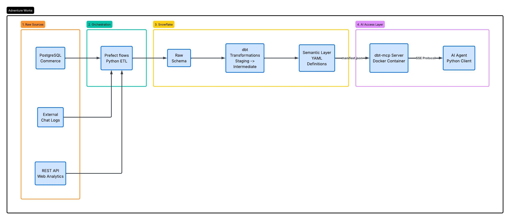

# Agentic Data Pipeline with Snowflake, dbt, and MCP

> A production-grade data platform that extracts siloed e-commerce data, transforms it into a documented semantic layer, and exposes it to AI agents via a Model Context Protocol (MCP) server for ad-hoc natural language querying.

## Architecture



**Caption:** End-to-end data flow from raw, siloed source systems through Prefect orchestration, transformed in Snowflake via dbt, and ultimately served to AI agents through an MCP server.

---

## Problem Statement

Adventure Works' business performance data was siloed: customer profiles lived in PostgreSQL, chat logs were trapped in MongoDB, and web traffic was stuck behind a REST API. Stakeholders could not connect the dots between metrics such as attributing revenue to a marketing campaign without waiting weeks for the data team to build hardcoded dashboards. This platform centralizes that fragmented data and establishes an agent-friendly querying layer that allows non-technical stakeholders to ask ad-hoc questions and receive accurate answers quickly. 

---

## Tech Stack

| Layer | Technology | Why |
|-------|-----------|-----|
| Source Systems | PostgreSQL, MongoDB, REST API | Represents the real-world diversity of structured, semi-structured, and external data that businesses manage. |
| Extraction | Python ETL Processor | Enabled custom extraction logic and precise handling of varied data types before pushing raw data to the warehouse. |
| Warehouse | Snowflake | Chosen for its separation of compute and storage, which prevents idle resource costs, and its support for querying semi-structured JSON data. |
| Transformation | dbt | Essential for building a robust semantic layer, established clear business rules, grain, and data mapping required for agent-friendly modeling. |
| Orchestration | Prefect | Replaced manual scripts with an orchestration layer that provided automatic retries for brittle APIs and clear observability into pipeline failures. |
| CI/CD | dbt Cloud + GitHub | Enabled modern software engineering practices, ensuring that our SQL transformations are version-controlled, tested, and auto deployed. |
| Agent Access | dbt MCP Server | Bridges the gap between the warehouse and LLMs. Dbt models are standardized tools which allow AI agents to navigate the database safely without credentials. |
| Containerization | Docker Compose | Eliminated local machine inconsistencies by containerizing the pipeline and MCP server so that local dependency headaches can be avoided.  |

---

## Data Flow

**Ingestion:** Data enters the platform from three different sources: commerce data flows to a PostgreSQL database, chat logs flow into a MongoDB database, and web analytics are gathered via a REST API. A custom Python processor extracts the raw data from these sources and loads it directly into Snowflake, which is where our foundation of raw data is. Prefect manages this flow and ensures reliable execution. 

**Transformation:** Once the data is in Snowflake, dbt builds the semantic layer. Staging models like stg_adventure_db__customers clean the data by transforming it into correct data types and standardizing column names. Intermediate models like int_web_analytics_with_customers then apply business logic to join the cleaned sources together, which is where customer attributes are attached to web events and transactions.

**Serving:** The final data is served through documented YML files. Instead of creating static dashboards, the semantic layer is connected to an AI agent via a dbt MCP server. Because the documentation explicitly defines table grains and join connections, the agent can autonomously reason through the data to write accurate SQL for ad-hoc business questions. Data accuracy is verified by automated dbt tests.

---

## Setup and Run

### Prerequisites
- Docker Desktop
- Snowflake account (trial works)
- Python 3.9+
- dbt Cloud account (free tier)

### Quick Start

```bash
# 1. Clone the repository
git clone https://github.com/thyscall/agentic-data-pipeline-mcp.git
cd agentic-data-pipeline-mcp

# 2. Configure environment
cp .env.sample .env
# Edit .env with your Snowflake credentials

# 3. Create raw tables in Snowflake
# Execute the following scripts in your Snowflake worksheet:
# - sql/create_raw_tables.sql for sales and chat data
# - prefect/snowflake_objects.sql (for web analytics data)

# 4. Start all services
docker compose up -d

# 5. Run dbt models and tests
cd dbt
dbt build

# 6. Start the MCP server
docker compose up dbt-mcp -d

# 7. (Optional) Run the MCP demo
cd mcp
uv sync
uv run python demo_client.py
```

### Environment Variables

| Variable | Description |
|----------|-------------|
| `SNOWFLAKE_ACCOUNT` | Full Snowflake account identifier (e.g., `ab12345.us-east-1`) |
| `SNOWFLAKE_USER` | Snowflake username |
| `SNOWFLAKE_PASSWORD` | Snowflake password |
| `SNOWFLAKE_WAREHOUSE` | Compute warehouse name (e.g., `AW_WH`) |
| `SNOWFLAKE_DATABASE` | Target database (e.g., `ADVWRKS`) |
| `SNOWFLAKE_ROLE` | Snowflake role (default: `ACCOUNTADMIN`) |

See `.env.sample` for the full list.

---

## Project Milestones

### Milestone 1: Core Pipeline
Built a containerized Python ETL microservice using Docker to extract raw data from PostgreSQL and MongoDB. Established the foundational dbt architecture in Snowflake, creating staging and intermediate models. Staged the data in Snowflake and established the foundational dbt architecture by creating staging models to combine these sources with the existing Adventure Works warehouse. Then built a Snowsight dashboard to visualize initial sales trends.

### Milestone 2: Orchestration, Quality, and Agent-Assisted Development
Expanded the pipeline by integrating web analytics via a REST API as the third data source. Prefect handles scheduling, connection retries, and error handling. Implemented dbt data quality tests, freshness tests, and CI/CD pipelines using dbt Cloud. Used Cursor to build the Prefect flows and documented the architecture and agent relationships in a PRD.

### Milestone 3: Agent Access and Portfolio
Deployed a local dbt Model Context Protocol (MCP) server to connect the static warehouse to an AI agent. Upgraded standard dbt YAML documentation into a machine-readable semantic layer, enabling AI agents to autonomously navigate table relationships. Validated this architecture using a Python demo client.

---

## Key Metrics

| Metric | Value |
|--------|-------|
| Raw records processed per cycle | 47 |
| Pipeline execution time | 21.98 seconds |
| dbt models | 28 |
| dbt tests | 31 |
| Test pass rate | 100% |
| Data sources integrated | 4 |
| Source tables | 10 |
| Models exposed via MCP | 21 |
| Source freshness SLA | 24 hours |

---

## What I Learned

This project shifted my perspective on data engineering because it has changed from building pipelines to move data from Point A to Point B to also designing a semantic layer to standardize and make sense of data for both stakeholders and agentic technologies. I enjoyed learning about the formal and scalable steps to gathering and cleaning raw data from databases and APIs. If I was to build this exact pipeline over again, I would build the agent-friendly metadata and YAML descriptions in the beginning along with the initial staging models. Ultimately, I learned that a modern data engineer's biggest value add is establishing a contextualized source of truth that enables both human stakeholders and AI to make accurate business decisions.

---

## Future Improvements

- **Dynamic Data Masking for PII:** The AI agent currently has access to staging tables that contain customer names and contact information. To deploy this in a production environment, I would implement Snowflake's dynamic data masking policies so that even if the AI agent hallucinates or is prompted maliciously, it is restricted from accessing and exposing PII.
- **Cost & Behavior Guardrails:** Connecting a data warehouse to an AI agent can lead to unpredictable query behavior. I would implement strict monitors and specific warehouse timeouts in Snowflake for the MCP agent's role. This solves the risk of an agent generating a poorly optimized query that burns through compute budget while trying to answer a simple prompt.
- **AI Query Verification:** A number is a guess until it can be verified. I would build a query logging system that captures the exact SQL generated by the dbt MCP server and displays it in a dashboard to support the dashboard metrics if called upon. This would allow data engineers to audit the LLM's reasoning, catch hallucinations early, and build stakeholder trust in the agent's output.

---
